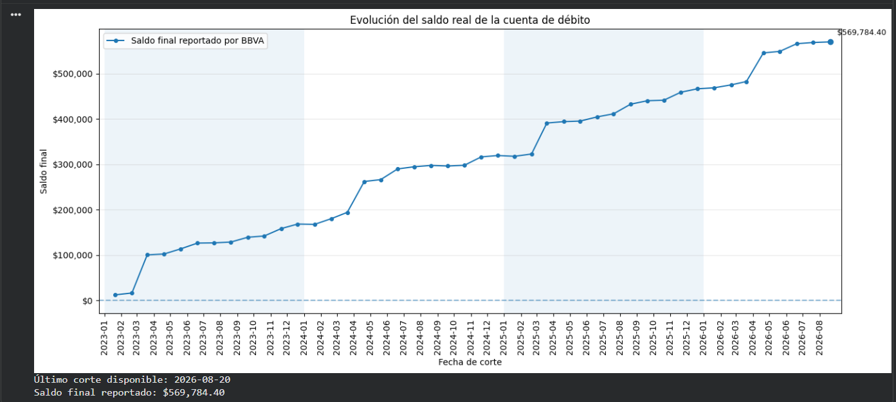
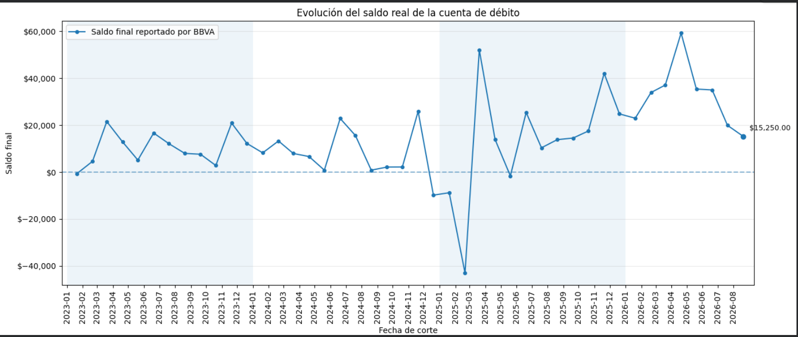
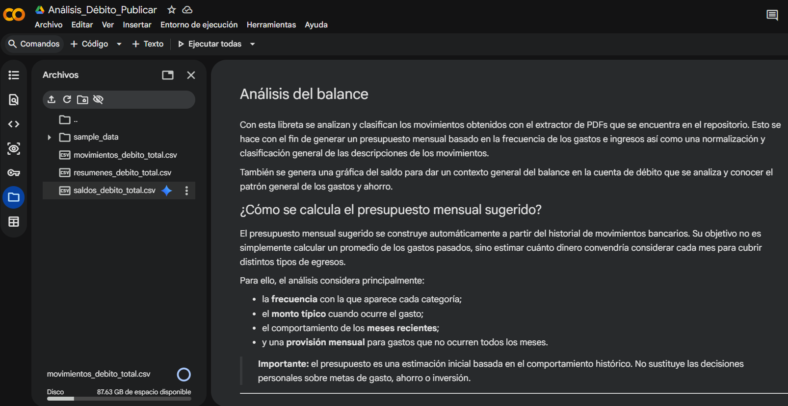

# Analytics Balance Creator

Analytics Balance Creator es un proyecto en Python para **extraer, validar, consolidar y analizar información financiera** proveniente de estados de cuenta BBVA en formato PDF.

Actualmente hay muchos modelos de IA que permiten hacer lo mismo de manera más simple, pero estos son costosos y conservan la información de sus usuarios. Esta alternativa es completamente gratuita y no hace falta subir información personal o sensible como lo son los estados de cuenta.

Actualmente, el flujo estable del proyecto está enfocado en **estados de cuenta de débito BBVA**. Se está trabajando en una versión para tarjetas de crédito.

El proyecto permite extraer movimientos, saldos y resúmenes de los estados de cuenta, validar los datos obtenidos contra los valores reportados por BBVA y consolidar múltiples periodos para construir un historial financiero.

También se incluye una libreta compatible con **Google Colab y Jupyter Notebook** para analizar los datos, visualizar la evolución del saldo, clasificar movimientos y generar una primera propuesta automática de presupuesto mensual. Más adelante se muestran un par de ejemplos con datos sintéticos que ayudan a dar una vista rápida los datos extraidos.

---

## Funcionalidades

### Extracción de cuenta de débito

- Extrae movimientos desde estados de cuenta BBVA en PDF.
- Identifica cargos y abonos utilizando la posición espacial de los elementos dentro del PDF.
- Soporta diferentes estructuras históricas de estados de cuenta.
- Extrae saldos iniciales y finales.
- Extrae los totales reportados por BBVA.
- Genera archivos CSV individuales y consolidados.

### Validación

Los movimientos extraídos se validan contra los valores reportados directamente por BBVA.

La principal comprobación de consistencia es:

```text
Saldo final = Saldo anterior + Abonos - Cargos
```

También se comparan:

```text
Abonos extraídos = Abonos reportados por BBVA
Cargos extraídos = Cargos reportados por BBVA
```

Esta validación debe completarse antes de utilizar los datos para análisis financieros.

### Análisis financiero

La libreta de Google Colab/Jupyter permite realizar:

- visualización histórica del saldo;
- análisis mensual de ingresos y egresos;
- análisis de flujo de efectivo;
- normalización de descripciones;
- identificación de comercios;
- clasificación automática de movimientos;
- detección de movimientos extraordinarios;
- identificación de pagos de tarjeta de crédito;
- separación de ahorro e inversión;
- generación automática de una propuesta de presupuesto mensual.

---

## Ejemplo de análisis

La libreta transforma los estados de cuenta consolidados en información que permite visualizar la evolución de la cuenta y analizar los patrones históricos de gasto.

Las siguientes imágenes fueron generadas utilizando **datos financieros completamente sintéticos**. No contienen movimientos bancarios ni información financiera personal real.

### Datos simulados

Los saldos extraídos directamente de los estados de cuenta permiten reconstruir la evolución histórica real de la cuenta. 

En esta curva se observa un escenario ideal hipotético en el que una persona se administra de manera optima y responsable, guardando su dinero a lo largo del tiempo.



Sin embargo, sabemos que los hábitos de consumo de nuestra epoca para la clase trabajadora, no son controlados y eso suele generar deuda o por lo menos un saldo cercano a cero la mayor parte del tiempo. Esta curva puede darnos una idea general de nuestra relación con el dinero y nos permite ver los meses en los que gastamos más porque parece que tenemos más.



La gráfica NO da información granular ya que cada persona ahorra o gasta dependiendo de distintas situaciones que pueden ser extarnas como el tratamiento de una enfermedad o el apoyo económico que se da a un familiar.

Se debe tener en mente que esta herramienta tiene la finalidad de brindar una mirada detallada al flujo de dinero para observar y decidir de manera conciente "cuándo" y "en qué" gastamos. Con el CSV de la información extraida se pueden crear hojas de cálculo u otros scripts más apegados a lo que queroms lograr. Un uso de gran utilidad, es el presupuesto generado, que debe interpretarse como un punto de partida basado en el comportamiento histórico y no como una recomendación financiera definitiva. Como recomendación el presupuesto obtenido se debe comparar de manera manual con lo que tenemos identificado de manera empírica, ya sea utilizando uno existente o generando uno "ideal" de acuerdo a lo que contemplamos mes con mes o quincena con quincena.

Para comenzar a utilizar la herramienta accede a la [documentación completa](docs/index.md) en la que se describe la metodología utilizada y los pasos a seguir para generar la curva y el presupuesto.

---

## Estado del proyecto

| Componente | Estado |
|---|---|
| Extracción de movimientos de débito | Estable |
| Extracción de saldos de débito | Estable |
| Extracción de resúmenes de débito | Estable |
| Validación de débito | Estable |
| Consolidación de débito | Estable |
| Análisis en Colab/Jupyter | Funcional |
| Clasificación de movimientos | Funcional / en evolución |
| Estimación de presupuesto mensual | Funcional / en evolución |
| Extracción de tarjeta de crédito | En desarrollo |
| Integración débito + tarjeta de crédito | Planeada |

Los scripts relacionados con tarjeta de crédito (`TDC`) son experimentales y actualmente no deben utilizarse para obtener resultados financieros definitivos.

---

## Inicio rápido

### 1. Clonar el repositorio

```bash
git clone git@github.com:mundopacheco/Analytics_Balance_Creator.git
cd Analytics_Balance_Creator
```

### 2. Crear un entorno virtual

Para facilitar las cosas recomiendo utilizar **Anaconda** o **Miniconda**, así que primero deberas descargar e instalar alguna versión en tu computadora o si ya tienes experiencia con python puedes saltarte este paso y validar directamente si cuentas con las librerías necesarias para correr el script principal. De otro modo, puedes crear un entorno aislado para ejecutar el proyecto sin modificar tu instalación principal de Python desde una terminal de Anaconda:

```bash
conda create --name EdosEnv python=3.12
```

Cuando Conda solicite confirmación:

```text
Proceed ([y]/n)?
```

escribe:

```text
y
```

Activar el entorno:

```bash
conda activate EdosEnv
```

### 3. Instalar las dependencias

Con el entorno activo, instala las dependencias necesarias:

```bash
pip install pandas pymupdf numpy matplotlib
```

Si también quieres trabajar con la documentación local del proyecto:

```bash
pip install mkdocs
```

### 4. Verificar la instalación

Puedes comprobar la versión de Python con:

```bash
python --version
```

Y verificar que las principales dependencias puedan importarse:

```bash
python -c "import pandas, fitz, numpy, matplotlib; print('Dependencias instaladas correctamente')"
```

#### Volver a utilizar el entorno

Si por alguna razón cerraste la terminal de Anaconda y necesitas volver a ejecutar debes volver a activar el entorno, no es necesario crearlo nuevamente ni instalar las dependencias, solo usa:

```bash
conda activate EdosEnv
```

#### Documentación

Si quieres ejecutar la documentación del repo local y verla en un navegador ejecuta:

```bash
mkdocs serve
```

Y visita la URL que aparece en tu terminal. O también puedes ver la documentación completa [aqui](docs/index.md).

### 5. Descargar los estados de cuenta

Descarga desde la app de BBVA los estados de cuenta de débito que quieras analizar y colócalos en la carpeta:

```text
Estados de cuenta/
```

Se recomienda usar la mayor cantidad de estados de cuenta disponibles para que mejore el análisis. Utiliza nombres que incluyan el mes y el año para cada archivo:

```text
Enero 2025.pdf
Febrero 2025.pdf
Marzo 2025.pdf
```

### 6. Procesar los estados de cuenta

Con el entorno `EdosEnv` activo, y las librerías instaladas ya puedes ejecutar el script de extracción. Debes contar con los PDF's de los estados de cuenta en la carpeta correspondiente como se describe en el paso anterior. Recuerda que en tu terminal debes estar en la carpeta donde clonaste el repositorio y ejecutar:

```bash
python procesar_estados.py
```

Los archivos csv generados se organizan en la carpeta `csv_output`:

```text
csv_output/
├── consolidados/
├── saldos/
└── resumenes/
Enero 2025.csv
Febrero 2025.csv
Marzo 2025.csv
```

Antes de realizar el análisis, comprueba que los cargos, abonos y saldos extraídos coincidan con los valores reportados por BBVA. Durante la ejecución se hace una validación automática para cada insumo colocado, verás una leyenda que diga `VALIDACION OK: montos y conteos cuadran con el PDF.`, pero es recomendable validar algunos de manera manual o comparar los movimientos en el pdf del estado de cuenta con los movimeientos en el csv del mes correspondiente.

Valida que se hayan generado tres archivos csv dentro de la carpeta  `consolidados`:

```text
csv_output/consolidados/
movimientos_debito_total.csv
resumenes_debito_total.csv
saldos_debito_total.csv
```
Estos tres archivos serán necesarios para correr la libreta de de Jupyter `Análisis_Débito_Publicar.ipynb`.

---

## Análisis

La libreta de jupyter se puede utilizar para realizar el análisis de manera local sin utilizar Google Colab, sin embargo, fue diseñada desde Colab por lo cuál es más fácil subir la libreta y usarla desde ahí. Los archivos csv generados se subiran unicamente de manera temporal a la libreta y Google no los va a conservar después de que finalice la sesión del entorno de la libreta (que se cierra automaticamente después de cierto tiempo sin usar).

Si prefieres hacer el análisis con Google Colab, basta con cargar el archivo de la libreta a tu Drive de Google y abrirlo utilizando Colab. Luego debes subir los archivos csv generados en la carpeta local `consolidados` a la carpeta que se encuentra dentro de la libreta llamada `Content` (esta se encuentra en la barra lateral izquierda).

**Ojo:** NO coloques la información dentro de `sample_data`, puedes arrastrar y soltar tus archivos CSV justo debajo de la carpeta `sample_data`, debe verse algo así:



Después sólo debes ejecutar todas las celdas.

Si prefieres no subir tu información a Google, puedes ejecutar la libreta de manera local:

### 1. Abrir una terminal en el repositorio

Entra a la carpeta donde clonaste el proyecto:

```bash
cd Analytics_Balance_Creator
```

### 2. Activar el entorno de Python

Si utilizas Anaconda o Miniconda:

```bash
conda activate EdosEnv
```

Si utilizas un entorno creado con `venv` en Windows PowerShell o CMD:

### 3. Instalar Jupyter

Con el entorno activo, instala Jupyter Notebook:

```bash
pip install notebook
```

También puedes utilizar JupyterLab:

```bash
pip install jupyterlab
```

Las principales dependencias utilizadas por el análisis pueden instalarse con:

```bash
pip install pandas numpy matplotlib
```

### 4. Iniciar Jupyter

Para utilizar Jupyter Notebook:

```bash
jupyter notebook
```

O, si prefieres JupyterLab:

```bash
jupyter lab
```

Se iniciará un servidor local y normalmente se abrirá automáticamente una dirección similar a:

```text
http://localhost:8888/
```

Si el navegador no se abre automáticamente, copia la URL mostrada en la terminal y ábrela manualmente.

### 5. Abrir la libreta

Desde el explorador de archivos de Jupyter, localiza la libreta incluida en el repositorio:

```text
Análisis_Débito_Publicar.ipynb
```

Haz clic sobre ella para abrirla.

### 6. Seleccionar el entorno correcto

Verifica que la libreta esté utilizando el entorno donde instalaste las dependencias. Si utilizas Conda y `EdosEnv` no aparece como kernel disponible, instala `ipykernel`:

```bash
conda activate EdosEnv
pip install ipykernel
```

Registra el entorno como kernel de Jupyter:

```bash
python -m ipykernel install --user --name EdosEnv --display-name "Python (EdosEnv)"
```

Después selecciona:

```text
Python (EdosEnv)
```

como kernel de la libreta.

### 7. Preparar los archivos de entrada

En la sección anterior se describe el flujo para obtener los archivos a procesar. El procesamiento genera los archivos utilizados posteriormente por la libreta, incluyendo los consolidados de:

```text
csv_output/consolidados/
movimientos_debito_total.csv
resumenes_debito_total.csv
saldos_debito_total.csv
```

> **Importante:** la libreta fue diseñada originalmente para funcionar también en Google Colab. Si alguna celda busca archivos específicamente dentro de `/content`, será necesario seleccionar los archivos manualmente o adaptar esa ruta para la ejecución local.

### 8. Ejecutar la libreta

Una vez cargados los archivos correctos, ejecuta las celdas en orden desde el inicio.

En Jupyter puedes utilizar:

```text
Run
→ Run All Cells
```

Esto es recomendable porque las diferentes etapas de la libreta dependen de variables y DataFrames creados en celdas anteriores.

El flujo general del análisis es:

```text
Carga de consolidados
        ↓
Limpieza de datos
        ↓
Validación
        ↓
Evolución del saldo
        ↓
Flujo mensual
        ↓
Normalización de movimientos
        ↓
Clasificación
        ↓
Presupuesto mensual
```

### 9. Detener Jupyter

Cuando termines, regresa a la terminal donde ejecutaste Jupyter y presiona:

```text
Ctrl + C
```

Confirma el cierre del servidor si Jupyter lo solicita.

Después puedes desactivar el entorno:

```bash
conda deactivate
```

o, si utilizas `venv`:

```bash
deactivate
```

### Volver a ejecutar la libreta

En sesiones posteriores no necesitas reinstalar Jupyter ni volver a crear el entorno.

Solamente ejecuta:

```bash
conda activate EdosEnv
jupyter notebook
```

o:

```bash
conda activate EdosEnv
jupyter lab
```


## Flujo general

El proyecto sigue el siguiente flujo:

```text
Estados de cuenta PDF
        │
        ▼
     Extracción
        │
        ├──► Movimientos
        ├──► Saldos
        └──► Resúmenes
                 │
                 ▼
             Validación
                 │
                 ▼
           Consolidación
                 │
                 ▼
        Libreta de análisis
                 │
        ┌────────┼────────┐
        ▼        ▼        ▼
      Saldo    Gastos   Ingresos

                 │
                 ▼
           Visualización
                 │
                 ▼
          Clasificación
                 │
                 ▼
       Presupuesto mensual
```

---

## Documentación

La documentación completa del proyecto está disponible en:

**[Abrir la documentación](docs/index.md)**

El manual incluye:

- [Primeros pasos](docs/getting-started.md)
- [Extractor de débito](docs/debit-extractor.md)
- [Archivos de salida](docs/output-files.md)
- [Validación](docs/validation.md)
- [Análisis en Colab](docs/colab-analysis.md)
- [Clasificación de movimientos](docs/transaction-classification.md)
- [Presupuesto mensual](docs/monthly-budget.md)
- [Solución de problemas](docs/troubleshooting.md)
- [Desarrollo de TDC](docs/tdc-development.md)
- [Interpretation](interpretation.md)

---
---

## Estructura general

La estructura principal del proyecto es:

```text
Analytics_Balance_Creator/
│
├── Estados de cuenta/
│
├── csv_output/
│   ├── consolidados/
│   ├── saldos/
│   └── resumenes/
│
├── docs/
│   ├── assets/
│   │   ├── balance-example.png
│   │   └── budget-example.png
│   │
│   ├── index.md
│   ├── getting-started.md
│   ├── debit-extractor.md
│   ├── output-files.md
│   ├── validation.md
│   ├── colab-analysis.md
│   ├── transaction-classification.md
│   ├── monthly-budget.md
│   ├── troubleshooting.md
│   └── tdc-development.md
│
├── extract_bbva_debito.py
├── procesar_estados.py
├── debug_pdf_text.py
├── mkdocs.yml
└── README.md
```

---

## Privacidad (Advertencia)

Este proyecto procesa información financiera personal. No deben incluirse en el repositorio, pero puede colocarse de manera local en las carpetas generadas:

```text
Estados de cuenta/
csv_output/
csv_output_tdc/
```

Estas rutas deben permanecer excluidas mediante `.gitignore`.

Antes de realizar cualquier commit, revisa:

```bash
git status
```

y confirma que no aparezcan:

- estados de cuenta en PDF;
- archivos CSV generados;
- datos bancarios;
- información financiera personal.

Las imágenes utilizadas como ejemplo en la documentación deben generarse utilizando **datos sintéticos o completamente anonimizados**.

---

## Limitaciones

El proyecto depende de la estructura de los estados de cuenta observados hasta el momento. Se utilizaron muestras de estados de cuenta que van desde agosto de 2022 hasta agosto 2026. Una nueva versión del PDF de BBVA puede requerir ajustes si cambian:

- los encabezados;
- la posición de las columnas;
- la estructura del resumen;
- el formato de las fechas;
- la organización de las páginas.

La clasificación automática de movimientos también utiliza reglas heurísticas y puede requerir revisión manual para operaciones que no puedan identificarse con suficiente confianza.

La libreta de Análisis está diseñada principalmente para meses continuos de información y es recomendable no saltarse ningún mes pero la extracción por otro lado no depende de que existan todos los meses.

---

## Aviso

Las herramientas de extracción y análisis están diseñadas para facilitar el análisis de finanzas personales.

Antes de utilizar los resultados para tomar decisiones financieras, valida siempre los movimientos, cargos, abonos y saldos contra los estados de cuenta originales.

La clasificación automática puede cometer errores y el presupuesto mensual generado es una estimación basada en el comportamiento histórico. Debe ajustarse de acuerdo con las circunstancias, necesidades y objetivos financieros de cada usuario.
